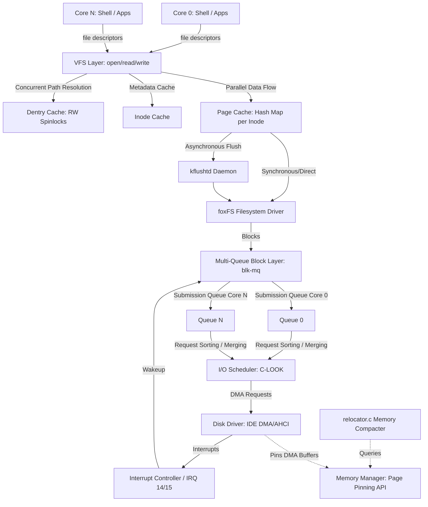

# High-Performance Filesystem (foxFS) and Subsystem Modernization Plan

To transition foxOS from a toy operating system to a painfully real, high-performance system, we need a massive leap in storage speed and robustness. This plan outlines the architecture for **foxFS** (a custom, extent-based, journaled filesystem) and the deep subsystem changes required in the drivers, block layer, memory manager, and VFS to achieve storage speeds matching or exceeding Linux.

To maximize performance on modern multi-core CPU architectures, foxOS is designed as a **Multithreading-First, SMP-native system**. By introducing multi-core booting, per-CPU queueing, and fine-grained locking, we completely eliminate serial bottlenecks.

---

## Technical Concept: Why Linux Storage is Fast (And How We Match It)
Linux achieves high-speed I/O through a highly integrated subsystem loop:
1. **DMA Controllers** move blocks directly between physical memory and disk without active CPU polling or byte-by-byte port I/O.
2. **Page Cache** acts as a memory buffer, intercepting read/write operations so that they execute at RAM speed ($O(1)$ lookup via radix trees) and are flushed to disk asynchronously.
3. **Dentry and Inode Caching** completely eliminate disk scans during path resolution (e.g., looking up `/etc/init/hello.txt` only reads directories from disk once).
4. **Extent-Based Layout** represents large runs of contiguous blocks with a single tiny metadata structure, enabling high sequential throughput.
5. **Delayed Allocation** groups multiple file writes in RAM and allocates contiguous blocks in one large chunk, minimizing disk fragmentation.
6. **SMP Scale & Multi-Queue I/O**: Eliminates lock contention by dividing workloads across independent core queues and using fine-grained locks.

---

## Proposed Changes & Architectural Blueprint

Below is the structured layout of changes across the foxOS codebase to implement this high-performance, multithreaded system.



---

## 1. Multicore Parallelism & SMP Subsystem Integration (`kernel/`)

### A. Multi-Core Boot (SMP Startup)
Instead of running exclusively on the Bootstrap Processor (BSP), we will boot all available Application Processors (APs) detected by `smp_init()`:
* **AP Trampoline Code**: Write a Real-Mode (16-bit) assembly trampoline mapped into low physical memory (< 1MB, e.g. at `0x8000`). This trampoline switches the APs from real mode to 32-bit protected mode, enables paging, and transitions them into 64-bit long mode.
* **INIT-SIPI-SIPI Sequence**: The BSP sends Inter-Processor Interrupts (IPI) via the Local APIC:
  1. An `INIT` IPI to reset APs.
  2. A `Startup` IPI (SIPI) pointing to the assembly trampoline.
  3. A backup SIPI if the AP doesn't respond within 200 microseconds.
* **Per-Core Initialization**: Each AP sets up its own Control Registers (CR0, CR3, CR4), Global Descriptor Table (GDT), Interrupt Descriptor Table (IDT), and CPU-specific TSS stack before registering with the scheduler.

### B. Multicore Scheduler with Work-Stealing
Upgrade the cooperative, single-queue scheduler in `sched.c` to a highly scalable SMP scheduler:
* **Per-CPU Runqueues**: Give each CPU core its own list of ready tasks. This avoids lock contention on a single global queue when scaling to multiple cores.
* **Preemptive Scheduling**: Use the Local APIC Timer on each core to trigger periodic context switches (`sched_tick`), replacing manual yield-points.
* **Work-Stealing Algorithm**: If a core's runqueue becomes empty, it attempts to "steal" a ready thread from another core's queue using atomic operations, maintaining perfect CPU load balancing.

---

## 2. Disk Driver Layer (`drivers/`)

### [NEW] [ahci.c](file:///home/sm/Desktop/foxOS/foxos/drivers/ahci.c) / [ahci.h](file:///home/sm/Desktop/foxOS/foxos/drivers/ahci.h) (or PCI IDE DMA in `drivers/ata.c`)
Transition from standard Programmed I/O (PIO) to **Bus-Mastering DMA (Direct Memory Access)**.
* **IDE DMA**: Set up Bus Master PRDTs (Physical Region Descriptor Tables) via PCI configuration space and controller base registers.
* **AHCI**: Implement the Serial ATA AHCI controller driver. This supports up to 32 command slots per port, allowing **Native Command Queuing (NCQ)**.
* **Interrupt-Driven**: Remove active busy-waiting in `status_wait()`. Register IRQ 14/15 (or MSI/MSI-X vectors under AHCI) so that the disk controller triggers an interrupt when a block transfer completes.
* **Thread Blocking**: The initiating thread puts itself to sleep (`THREAD_BLOCKED`) on a wait queue. The interrupt handler wakes it up when the DMA is done, freeing 100% of CPU cycles during disk transfers.

---

## 3. Kernel Memory Subsystem (`kernel/`)

To support fast storage and DMA while maintaining foxOS's unique **Moveable Allocations (UC memory)** and relocator daemon (`relocator.c`), we must add specific memory management tools.

### [MODIFY] [memory.h](file:///home/sm/Desktop/foxOS/foxos/kernel/memory.h) & [memory.c](file:///home/sm/Desktop/foxOS/foxos/kernel/memory.c)
* **Page Pinning / Locking API**:
  During DMA, the hard drive controller writes/reads directly to/from physical addresses. If the relocator (`move_defrag_all`) relocates pages mid-transfer, data corruption will occur. We must implement page pinning:
  ```c
  void pmm_pin_page(paddr_t paddr);
  void pmm_unpin_page(paddr_t paddr);
  int pmm_is_page_pinned(paddr_t paddr);
  ```
* **Page Cache Integration**:
  Create a global Page Cache using a hash map or radix tree indexed by `(inode_number, page_index)`. This cache maps logical file blocks to physical RAM pages.
* **Integration with Relocator**:
  Update `uc_defragment` and `move_defrag_all` to check if a page is pinned. If `pmm_is_page_pinned(paddr)` returns true, the compacting daemon must skip this page and try again later.

---

## 4. Block I/O & Request Layer

Introduce a block layer between filesystems and disk drivers to manage, merge, and optimize operations.

### [NEW] [bio.c](file:///home/sm/Desktop/foxOS/foxos/fs/bio.c) / [bio.h](file:///home/sm/Desktop/foxOS/foxos/fs/bio.h)
* **Scalable Multi-Queue Block I/O (`blk-mq` architecture)**:
  Instead of a single global queue that becomes a lock bottleneck on many-core systems, implement a multi-queue architecture. Each CPU core maps to its own **Software Submission Queue (SSQ)**. Block I/O requests are pushed locally to the SSQ of the current core without locking other cores' queues.
* **Unified Block Buffer Cache**:
  Maintains a pool of page-sized (4KB) buffers caching raw disk blocks.
* **I/O Request Merging and Scheduling**:
  Instead of sending single-block requests to the disk driver:
  1. Requests are queued.
  2. The block layer merges contiguous requests (e.g., merging requests for blocks 12, 13, 14, and 15 into a single 4-sector DMA transfer).
  3. The queue is sorted using a **C-LOOK (Circular LOOK) elevator algorithm** based on the Logical Block Address (LBA) to minimize disk arm seek latency.
* **Asynchronous Write-back Daemon (`kflushtd`)**:
  Create a kernel thread that runs in the background. It wakes up every $N$ seconds or when the dirty block ratio exceeds 10%, sorting and flushing dirty buffer pages to disk asynchronously.

---

## 5. Virtual File System Layer (`fs/vfs`)

Rewrite the current string-based, synchronous VFS layer to support UNIX-like paradigms.

### [MODIFY] [vfs.h](file:///home/sm/Desktop/foxOS/foxos/fs/vfs.h) & [vfs.c](file:///home/sm/Desktop/foxOS/foxos/fs/vfs.c)
* **Inode representation**:
  Add structural Inodes to the VFS. An Inode represents a file's metadata and maps logical file offsets to block numbers.
* **Fine-Grained Locking & Dentry Cache**:
  Implement a path-lookup cache that stores directory paths mapping to active inodes. To prevent lock contention during concurrent directory lookups (e.g., multiple threads looking up files in parallel), use **Reader-Writer Spinlocks**:
  ```c
  typedef struct vfs_dentry {
      char name[64];
      uint64_t inode_num;
      struct vfs_dentry* parent;
      struct vfs_dentry* hash_next;
  } vfs_dentry_t;
  ```
  Path resolution (e.g., opening `/usr/bin/hello`) will check the Dentry Cache first. Read operations acquire a reader spinlock in parallel, while directory mutations (mkdir, rm) acquire a writer spinlock.
* **Standardized File Handles**:
  Replace path-string functions with file descriptor tables:
  ```c
  int sys_open(const char* path, int flags, int mode);
  int sys_read(int fd, void* buf, size_t count);
  int sys_write(int fd, const void* buf, size_t count);
  int sys_lseek(int fd, int64_t offset, int whence);
  int sys_close(int fd);
  ```

---

## 6. The Core Engine: `foxFS` Filesystem

Create a custom, highly optimized file system designed for maximum IOPS and reliability.

### [NEW] [foxfs.c](file:///home/sm/Desktop/foxOS/foxos/fs/foxfs.c) / [foxfs.h](file:///home/sm/Desktop/foxOS/foxos/fs/foxfs.h)
* **Extent-Based Layout**:
  Replace the block pointer chain (used in FAT/Ext2) with *extents*. An extent represents a contiguous range of blocks:
  ```c
  typedef struct {
      uint32_t logical_block;   // Starting block relative to file start
      uint32_t physical_block;  // Starting block on physical disk
      uint32_t block_count;      // Length of contiguous block run
  } foxfs_extent_t;
  ```
  A standard `foxfs_inode_t` will store up to 4 extents inline. For files larger than 16KB (4 extents * 4KB), foxFS builds a B+ tree of extents. This permits addressing massive files (gigabytes) in a single disk command block.
* **Delayed Allocation (Delalloc)**:
  When writes occur, foxFS does not allocate disk blocks immediately. Instead, data is written to the Page Cache and marked dirty. When `kflushtd` flushes pages to disk, the file size is known, allowing the allocation of a single contiguous block run (extent). This eliminates fragmentation.
* **Metadata-Only Journaling (Ordered Mode)**:
  Ensure fast boot verification and crash recovery. Implement a transaction-based circular journal.
  Before updating the inode table or block bitmap:
  1. Write the transaction into the journal area.
  2. Flush the journal transaction to disk.
  3. Write data blocks to disk (ensuring files are updated).
  4. Write metadata to its final location.
  On sudden power failure, foxOS can verify and restore filesystem integrity in milliseconds by replaying the journal.
* **B-Tree Directory Indexing**:
  Instead of linear scans, directories are structured as B-Trees indexed by the hash of the filename, enabling $O(\log N)$ directory searches.

---

## Verification & Testing Plan

### Automated Verification (`verify_system.py`)
To test and verify the implementation, we will add diagnostic operations to `verify_system.py` and `kernel/tests.c`:
1. **`smptest`**: Verifies initialization of auxiliary CPU cores (APs), ensuring they switch successfully to 64-bit long mode and register with the scheduler.
2. **`dmatest`**: Validates IDE DMA or AHCI block transfers, ensuring zero CPU wait-loops and correct physical interrupt delivery.
3. **`cachetest`**: Verifies Page Cache hits. It writes a 1MB file, reads it back, and checks that disk reads are 0 (fully serviced by RAM).
4. **`concurrencytest`**: Spawns multiple threads across different CPU cores to perform high-frequency reads and writes to both identical and separate files to verify fine-grained locking and lack of lock contention.
5. **`crashrecoverytest`**: Simulates sudden crashes by interrupting writes to `foxFS`. The verifier restarts QEMU and checks that the journal restores file system consistency within 50ms without errors.
6. **`defragdmatest`**: Runs memory relocation stress tests simultaneously with high-throughput disk DMA to verify page pinning and prevent data corruption.

### Manual Verification
* Deploy a test image using `build.sh` under QEMU and run standard benchmark commands:
  ```bash
  foxos> foxfs_bench /testfile 10M
  ```
  This custom benchmark measures write/read speeds in MB/s to verify the improvements.
